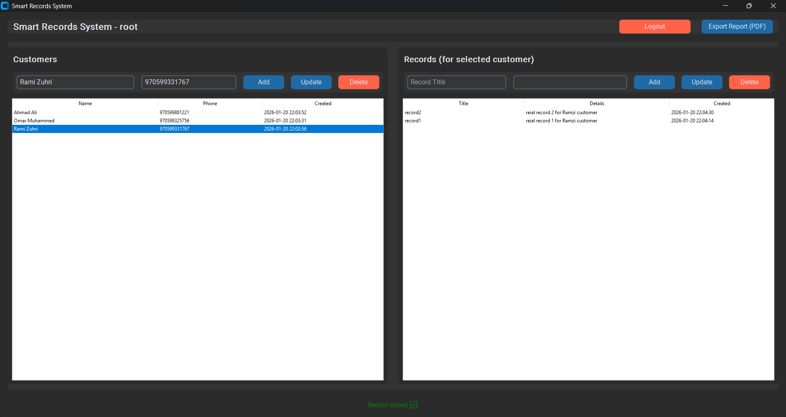

# 📁 Smart Records System

A professional Desktop Management Application built with **Python**, **CustomTkinter**, and **MySQL**. This system provides a streamlined interface for managing customer profiles and their associated historical records.

<br>
<hr>


## 📋 Table of Contents
1. [🌟 Key Features](#-key-features)
2. [🛠️ Tech Stack](#️-tech-stack)
3. [🚀 Getting Started](#-getting-started)
   - [1. Prerequisites](#1-prerequisites)
   - [2. Database Configuration](#2-database-configuration)
   - [3. Installation](#3-installation)
   - [4. Running the App](#4-running-the-app)
4. [📁 Project Structure](#-project-structure)
5. [📝 License](#-license)
6. [🤝 Contact](#-contact)

<br>
<hr>

## 🌟 Key Features

## 🌟 Key Features

- **Modern UI:** A sleek, dark-mode interface powered by **CustomTkinter** with a split-view layout.
- **Secure Authentication:** User-specific sessions (root access shown) with secure logout.
- **Customer CRM:** Manage a database of clients with names and phone numbers.
- **Linked Record Tracking:** - Create multiple text-based records for each selected customer.
    - Real-time updates: Status bar notifications (e.g., "Record added").
- **PDF Reporting:** Export comprehensive customer and record data via the "Export Report" feature.
- **Relational Database:** Powered by **MySQL** with high data integrity.


<br>
<hr>

## 📸 Preview
> 

<br>
<hr>

## 🛠️ Tech Stack

| Technology | Purpose |
| :--- | :--- |
| **Python 3.x** | Core Programming Language |
| **CustomTkinter** | Modern UI/UX Framework |
| **MySQL** | Relational Database Management |
| **ReportLab** | PDF Document Generation |
| **mysql-connector** | Database Connectivity |

<br>
<hr>

## 🚀 Getting Started

### 1. Prerequisites
Ensure you have a **MySQL Server** (like MySQL Workbench or XAMPP) installed and running.

### 2. Database Configuration
- Edit you connection details (specialy username + password) in db file
- Execute this script in your MySQL terminal to initialize the database:

``` sql
CREATE DATABASE IF NOT EXISTS smart_records
  CHARACTER SET utf8mb4
  COLLATE utf8mb4_general_ci;

USE smart_records;

-- 1. Users table for login
CREATE TABLE IF NOT EXISTS users (
  id INT AUTO_INCREMENT PRIMARY KEY,
  username VARCHAR(100) UNIQUE,
  password VARCHAR(100)
);

-- 2. Customers table linked to user
CREATE TABLE IF NOT EXISTS customers (
  id INT AUTO_INCREMENT PRIMARY KEY,
  user_id INT,
  name VARCHAR(200),
  phone VARCHAR(50),
  created_at TIMESTAMP DEFAULT CURRENT_TIMESTAMP,
  FOREIGN KEY (user_id) REFERENCES users(id) ON DELETE CASCADE
);

-- 3. Records table linked to customer
CREATE TABLE IF NOT EXISTS records (
  id INT AUTO_INCREMENT PRIMARY KEY,
  customer_id INT,
  title VARCHAR(200),
  details TEXT,
  created_at TIMESTAMP DEFAULT CURRENT_TIMESTAMP,
  FOREIGN KEY (customer_id) REFERENCES customers(id) ON DELETE CASCADE
);
```
3. Installation
Clone the repository and install dependencies:
```
git clone [https://github.com/yourusername/motor-records-system.git](https://github.com/yourusername/motor-records-system.git)
cd motor-records-system
python -m pip install customtkinter mysql-connector-python reportlab
```
4. Running the App
```
python main.py
```

<br>
<hr>

## 📁 Project Structure
main.py: The entry point. Handles UI logic, screen transitions, and PDF generation.

db.py: Data access layer containing all SQL queries and connection handling.

README.md: Project documentation (this file).

<br>

## 📝 License
Distributed under the MIT License. See LICENSE for more information.

<br>

## 🤝 Contact
Tarik Hamdan - [tarikhamdan42@gmail.com]  <br>
Mahmoud Abu Alseba'a - [mahmoudjawad02025@gmail.com]  <br>
Project Link: [https://github.com/mahmoudjawad-2025/Python-Project.git]
